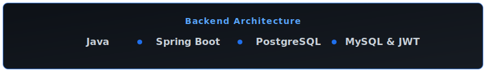
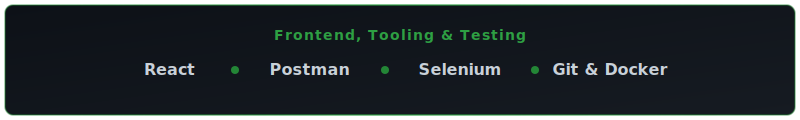

<div align="center">
  <picture>
    <source media="(prefers-color-scheme: dark)" srcset="./assets/banner.svg">
    <source media="(prefers-color-scheme: light)" srcset="./assets/banner.svg">
    
  </picture>
  <br>

  # Junade Govender

  **Backend Engineer focused on building scalable, secure, and production-ready applications.**
</div>

<div align="center">

[](https://linkedin.com/in/junade-govender-39ba092a3)
[](mailto:junade0708@gmail.com)
[](https://github.com/JunadeG)

<br>


<br>


</div>

### Developer Console

                                    ```text
                                            ┌─────────────────────────────────────────────────────────────┐
                                            │                                                             │
                                            │  > whoami                                                   │
                                            │                                                             │
                                            │    Junade Govender                                          │
                                            │                                                             │
                                            │  > role                                                     │
                                            │                                                             │
                                            │    Software Developer @ Easyfind                            │
                                            │                                                             │
                                            │  > location                                                 │
                                            │                                                             │
                                            │    Johannesburg, South Africa                               │
                                            │                                                             │
                                            │  > focus                                                    │
                                            │                                                             │
                                            │    • Backend Architecture                                   │
                                            │    • Spring Boot Ecosystem                                  │
                                            │    • Secure REST APIs                                       │
                                            │    • PostgreSQL Databases                                   │
                                            │    • Selenium Automation                                    │
                                            │                                                             │
                                            └─────────────────────────────────────────────────────────────┘
                                    

<div align="center">
  
</div>

### Technical Arsenal

<div align="center">
  
  <br><br>
  
</div>

<br>
<div align="center">
  
</div>

### Featured Architecture

<div align="center">
  <a href="https://github.com/JunadeG">
    
  </a>
  <a href="https://github.com/JunadeG">
    
  </a>
</div>

<br>
<div align="center">
  
</div>

### GitHub Activity Grid

<div align="center">
  <picture>
    
  </picture>
</div>

<br>
<div align="center">
  
</div>

### Engineering Philosophy

I design software that is secure by default, easy to maintain, and built for long-term scalability—not just to solve today's problem, but to support tomorrow's growth.

**Core Principles:**  
`Secure` • `Fast` • `Modular` • `Fully Tested` • `Production Ready` • `Maintainable`

<div align="center">
  
  <br>
  <p style="color: #8B949E; font-size: 14px;">Building software that solves real business problems.</p>
</div>
