<div align="center">
  <picture>
    <source media="(prefers-color-scheme: dark)" srcset="./assets/banner.svg">
    <source media="(prefers-color-scheme: light)" srcset="./assets/banner.svg">
    
  </picture>
  <br>

  # Junade Govender

  **Backend Engineer focused on building scalable, secure, and production-ready applications.**
</div>

<div align="center">

[](https://linkedin.com/in/junade-govender-39ba092a3)
[](mailto:junade0708@gmail.com)
[](https://github.com/JunadeG)

<br>


<br>


</div>

### Developer Console

```text
┌─────────────────────────────────────────────────────────────┐
│                                                             │
│  > whoami                                                   │
│                                                             │
│    Junade Govender                                          │
│                                                             │
│  > role                                                     │
│                                                             │
│    Software Developer @ Easyfind                            │
│                                                             │
│  > location                                                 │
│                                                             │
│    Johannesburg, South Africa                               │
│                                                             │
│  > focus                                                    │
│                                                             │
│    • Backend Architecture                                   │
│    • Spring Boot Ecosystem                                  │
│    • Secure REST APIs                                       │
│    • PostgreSQL Databases                                   │
│    • Selenium Automation                                    │
│                                                             │
└─────────────────────────────────────────────────────────────┘
```

<div align="center">
  
</div>

### Technical Arsenal

**Backend & Architecture**


**Frontend & Tooling**


<div align="center">
  
</div>

### Current Development Focus

```text
Enterprise HRMS
├── Multi-Tenant Architecture
├── Payroll Automation
├── Attendance Tracking
├── JWT Authentication
├── Email Queueing
└── React Frontend Integration

Infrastructure & Continuous Learning
├── Docker & Containerization
├── Kubernetes
├── Spring Cloud
└── AWS Cloud Services
```

<div align="center">
  
</div>

### Engineering Philosophy

I design software that is secure by default, easy to maintain, and built for long-term scalability—not just to solve today's problem, but to support tomorrow's growth.

**Core Principles:**  
`Secure` • `Fast` • `Modular` • `Fully Tested` • `Production Ready` • `Maintainable`

<div align="center">
  
</div>

### GitHub Metrics

<div align="center">
  <a href="https://github.com/JunadeG">
    
  </a>
  <a href="https://github.com/JunadeG">
    
  </a>
</div>

<div align="center">
  
  <br>
  <p style="color: #8B949E; font-size: 14px;">Building software that solves real business problems.</p>
</div>
